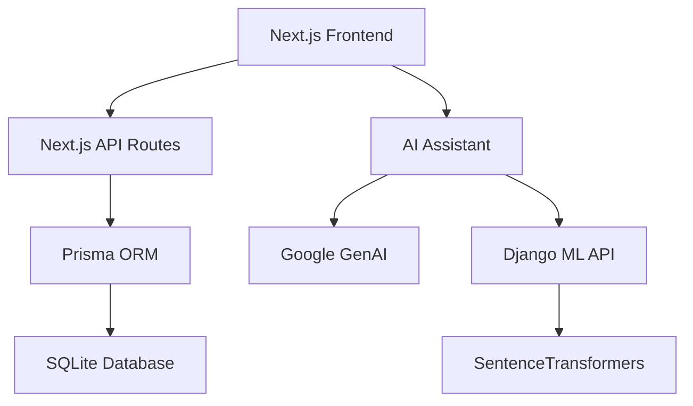

# 🚀 **AI-Powered Notion Clone**

[](https://nextjs.org/)
[](https://reactjs.org/)
[](https://www.typescriptlang.org/)
[](https://www.djangoproject.com/)
[](https://ai.google.dev/)

> **Modern, AI-destekli not alma uygulaması.** Notion'un güçlü özelliklerini modern teknolojilerle buluşturan, makine öğrenmesi entegrasyonlu platform.

## ✨ **Özellikler**

### 🎯 **Temel Özellikler**
- 📝 **Rich Text Editor** - TipTap ve BlockNote ile gelişmiş metin editörü
- 🗂️ **Organizasyon** - Notları sınıflara göre düzenleme
- 🔐 **Güvenli Kimlik Doğrulama** - JWT tabanlı login/register sistemi
- 🗃️ **Veritabanı Yönetimi** - Prisma ORM ile güçlü veri yönetimi
- 📱 **Responsive Tasarım** - Tüm cihazlarda mükemmel deneyim

### 🤖 **AI & ML Özellikleri**
- 💬 **AI Asistan** - Google Gemini 2.5 Flash entegrasyonu
- 🧠 **Akıllı Öneriler** - SentenceTransformers ile semantik analiz
- 📊 **Konu Önerisi** - 50+ kategori için makine öğrenmesi destekli öneriler
- 🔄 **Real-time Chat** - AI ile anlık sohbet deneyimi

### 🎨 **Gelişmiş UI/UX**
- ✨ **Animasyonlar** - Karşılama efektleri ve confetti
- 🎯 **Motivasyonel Öğeler** - Kullanıcı deneyimini geliştiren etkileşimler
- 🌙 **Dark/Light Mode** - Göz yormayan tema desteği
- 📅 **Takvim Entegrasyonu** - Etkinlik ve not yönetimi

## 🏗️ **Mimari**



## 🛠️ **Teknoloji Stack'i**

### **Frontend**
- **Framework**: Next.js 14.2 (App Router)
- **UI Library**: React 18.2, TypeScript
- **Styling**: Tailwind CSS, Material-UI, HeroUI
- **State Management**: Zustand
- **Rich Text**: TipTap, BlockNote

### **Backend**
- **API**: Next.js API Routes
- **Database**: SQLite (Prisma ORM)
- **Authentication**: JWT + bcrypt
- **AI Integration**: Google GenAI (Gemini)

### **Machine Learning**
- **Framework**: Django + Django REST Framework
- **ML Library**: SentenceTransformers
- **Model**: all-MiniLM-L6-v2
- **Analysis**: Semantic similarity, topic recommendation

## 🚀 **Kurulum**

### **Gereksinimler**
- Node.js 18+
- Python 3.9+
- npm veya yarn

### **1. Repository'yi klonlayın**
```bash
git clone https://github.com/yourusername/ai-notion-clone.git
cd ai-notion-clone
```

### **2. Frontend Kurulumu (Next.js)**
```bash
cd notion
npm install
```

### **3. Environment Variables**
`.env` dosyası oluşturun:
```bash
cp .env.example .env
```

Gerekli API anahtarlarını ekleyin:
```env
JWT_SECRET=your-super-secret-jwt-key
DATABASE_URL="file:./dev.db"
GEMINI_API_KEY=your-gemini-api-key
```

### **4. Database Setup**
```bash
npx prisma generate
npx prisma db push
```

### **5. ML Backend Kurulumu (Django)**
```bash
cd ../mlproject
python -m venv venv
source venv/bin/activate  # Linux/Mac
# veya
venv\Scripts\activate     # Windows

pip install -r requirements.txt
python manage.py migrate
```

### **6. Uygulamayı Çalıştırın**

**Frontend (Port 3000):**
```bash
cd notion
npm run dev
```

**ML Backend (Port 8000):**
```bash
cd mlproject
python manage.py runserver
```

## 📊 **Database Schema**

### **Ana Tablolar**
- **User** - Kullanıcı bilgileri ve kimlik doğrulama
- **Note** - Notlar, içerik ve metadata
- **Comment** - Yorum sistemi
- **Event** - Takvim etkinlikleri
- **Notification** - Bildirim sistemi
- **UserMessages** - AI chat geçmişi

## 🔌 **API Endpoints**

### **Authentication**
- `POST /api/login` - Kullanıcı girişi
- `POST /api/register` - Kullanıcı kaydı
- `PUT /api/updatepassword` - Şifre güncelleme

### **Notes**
- `GET /api/notes/allnotes` - Tüm notları getir
- `POST /api/notes/savenote` - Not kaydet
- `DELETE /api/notes/deletenote` - Not sil
- `PUT /api/notes/updatenote` - Not güncelle

### **AI Services**
- `POST /api/aiserver/submitmessage` - AI'a mesaj gönder
- `GET /api/aiserver/getallmessages` - Chat geçmişi

### **ML Recommendations**
- `POST /recommender/analyze/` - Mesaj analizi ve konu önerisi

## 🌟 **Öne Çıkan Özellikler**

### **AI Asistan**
```typescript
// AI ile sohbet örneği
const response = await fetch('/api/aiserver/submitmessage', {
  method: 'POST',
  headers: { 'Content-Type': 'application/json' },
  body: JSON.stringify({ message: 'Python hakkında not almak istiyorum' })
});
```

### **Konu Önerisi Sistemi**
```python
# Semantic analiz ile konu önerisi
messages = ["machine learning", "python", "data science"]
recommendations = model.analyze_messages(messages)
# Output: ["teknoloji", "programlama", "veri bilimi"]
```

## 🔒 **Güvenlik**

- **JWT Authentication** - Güvenli token tabanlı kimlik doğrulama
- **Password Hashing** - bcrypt ile şifre güvenliği
- **Input Validation** - Zod ile veri doğrulama
- **CORS Protection** - Cross-origin isteklerin kontrolü

## 📱 **Demo**

🌐 **Live Demo**: [https://your-app.vercel.app](https://your-app.vercel.app)

### **Demo Hesap**
- **Email**: demo@example.com
- **Password**: demo123

## 🤝 **Katkıda Bulunma**

1. Fork edin
2. Feature branch oluşturun (`git checkout -b feature/amazing-feature`)
3. Commit edin (`git commit -m 'Add amazing feature'`)
4. Push edin (`git push origin feature/amazing-feature`)
5. Pull Request açın

## 📄 **Lisans**

Bu proje MIT lisansı altında lisanslanmıştır. Detaylar için [LICENSE](LICENSE) dosyasına bakın.

## 👨‍💻 **Geliştirici**

**Bilal** - Yazılım Mühendisliği 2. Sınıf Öğrencisi

## 🙏 **Teşekkürler**

- [Next.js](https://nextjs.org/) - Harika React framework'ü
- [Prisma](https://prisma.io/) - Modern ORM
- [Google GenAI](https://ai.google.dev/) - AI entegrasyonu
- [SentenceTransformers](https://www.sbert.net/) - Semantic analysis
- [Vercel](https://vercel.com/) - Hosting platform

---

⭐ **Bu projeyi beğendiyseniz yıldız vermeyi unutmayın!** ⭐
