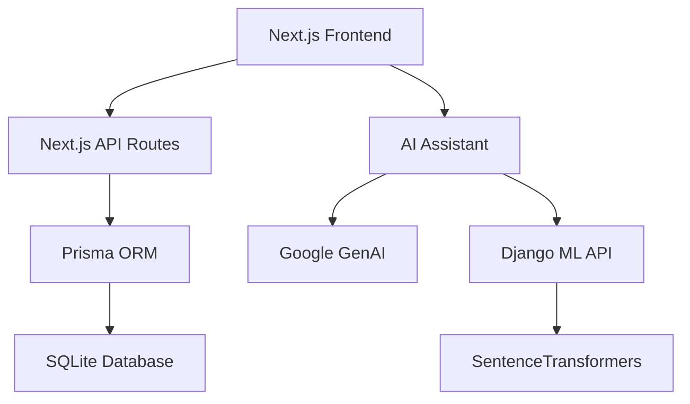

# 🚀 **AI-Powered Note Site**

Try DEmo Version On Vercel:
https://notion-5erifttej-bilals-projects-5afe78f4.vercel.app/


> **Modern, AI-powered note-taking application.** A platform that combines Notion's powerful features with modern technologies and machine learning integration.

## ✨ **Features**

### 🎯 **Core Features**
- 📝 **Rich Text Editor** - Advanced text editor with TipTap and BlockNote
- 🗂️ **Organization** - Organize notes by classes/categories
- 🔐 **Secure Authentication** - JWT-based login/register system
- 🗃️ **Database Management** - Powerful data management with Prisma ORM
- 📱 **Responsive Design** - Perfect experience on all devices

### 🤖 **AI & ML Features**
- 💬 **AI Assistant** - Google Gemini 2.5 Flash integration
- 🧠 **Smart Recommendations** - Semantic analysis with SentenceTransformers
- 📊 **Topic Suggestions** - ML-powered recommendations for 50+ categories
- 🔄 **Real-time Chat** - Instant chat experience with AI

### 🎨 **Advanced UI/UX**
- ✨ **Animations** - Welcome effects and confetti
- 🎯 **Motivational Elements** - User experience enhancing interactions
- 🌙 **Dark/Light Mode** - Eye-friendly theme support
- 📅 **Calendar Integration** - Event and note management

## 🏗️ **Architecture**



## 🛠️ **Tech Stack**

### **Frontend**
- **Framework**: Next.js 14.2 (App Router)
- **UI Library**: React 18.2, TypeScript
- **Styling**: Tailwind CSS, Material-UI, HeroUI
- **State Management**: Zustand
- **Rich Text**: TipTap, BlockNote

### **Backend**
- **API**: Next.js API Routes
- **Database**: SQLite (Prisma ORM)
- **Authentication**: JWT + bcrypt
- **AI Integration**: Google GenAI (Gemini)

### **Machine Learning**
- **Framework**: Django + Django REST Framework
- **ML Library**: SentenceTransformers
- **Model**: all-MiniLM-L6-v2
- **Analysis**: Semantic similarity, topic recommendation

## 🚀 **Installation**

### **Requirements**
- Node.js 18+
- Python 3.9+
- npm or yarn

### **1. Clone the repository**
```bash
git clone https://github.com/yourusername/ai-notion-clone.git
cd ai-notion-clone
```

### **2. Frontend Setup (Next.js)**
```bash
cd notion
npm install
```

### **3. Environment Variables**
Create `.env` file:
```bash
cp .env.example .env
```

Add required API keys:
```env
JWT_SECRET=your-super-secret-jwt-key
DATABASE_URL="file:./dev.db"
GEMINI_API_KEY=your-gemini-api-key
```

### **4. Database Setup**
```bash
npx prisma generate
npx prisma db push
```

### **5. ML Backend Setup (Django)**
```bash
cd ../mlproject
python -m venv venv
source venv/bin/activate  # Linux/Mac
# or
venv\Scripts\activate     # Windows

pip install -r requirements.txt
python manage.py migrate
```

### **6. Run the Application**

**Frontend (Port 3000):**
```bash
cd notion
npm run dev
```

**ML Backend (Port 8000):**
```bash
cd mlproject
python manage.py runserver
```

## 📊 **Database Schema**

### **Main Tables**
- **User** - User information and authentication
- **Note** - Notes, content and metadata
- **Comment** - Comment system
- **Event** - Calendar events
- **Notification** - Notification system
- **UserMessages** - AI chat history

## 🔌 **API Endpoints**

### **Authentication**
- `POST /api/login` - User login
- `POST /api/register` - User registration
- `PUT /api/updatepassword` - Password update

### **Notes**
- `GET /api/notes/allnotes` - Get all notes
- `POST /api/notes/savenote` - Save note
- `DELETE /api/notes/deletenote` - Delete note
- `PUT /api/notes/updatenote` - Update note

### **AI Services**
- `POST /api/aiserver/submitmessage` - Send message to AI
- `GET /api/aiserver/getallmessages` - Chat history

### **ML Recommendations**
- `POST /recommender/analyze/` - Message analysis and topic suggestions

## 🌟 **Key Features**

### **AI Assistant**
```typescript
// AI chat example
const response = await fetch('/api/aiserver/submitmessage', {
  method: 'POST',
  headers: { 'Content-Type': 'application/json' },
  body: JSON.stringify({ message: 'I want to take notes about Python' })
});
```

### **Topic Recommendation System**
```python
# Semantic analysis for topic suggestions
messages = ["machine learning", "python", "data science"]
recommendations = model.analyze_messages(messages)
# Output: ["technology", "programming", "data science"]
```

## 🔒 **Security**

- **JWT Authentication** - Secure token-based authentication
- **Password Hashing** - Password security with bcrypt
- **Input Validation** - Data validation with Zod
- **CORS Protection** - Cross-origin request control

## 📱 **Demo**

🌐 **Live Demo**: [https://your-app.vercel.app](https://your-app.vercel.app)

### **Demo Account**
- **Email**: demo@example.com
- **Password**: demo123

## 🤝 **Contributing**

1. Fork the project
2. Create your feature branch (`git checkout -b feature/amazing-feature`)
3. Commit your changes (`git commit -m 'Add amazing feature'`)
4. Push to the branch (`git push origin feature/amazing-feature`)
5. Open a Pull Request

## 📄 **License**

This project is licensed under the MIT License. See the [LICENSE](LICENSE) file for details.

## 👨‍💻 **Developer**

**Bilal** - Software Engineering 2nd Year Student


## 🙏 **Acknowledgments**

- [Next.js](https://nextjs.org/) - Amazing React framework
- [Prisma](https://prisma.io/) - Modern ORM
- [Google GenAI](https://ai.google.dev/) - AI integration
- [SentenceTransformers](https://www.sbert.net/) - Semantic analysis
-https://notion-5erifttej-bilals-projects-5afe78f4.vercel.app/ - Hosting platform

---

⭐ **If you like this project, don't forget to give it a star!** ⭐
